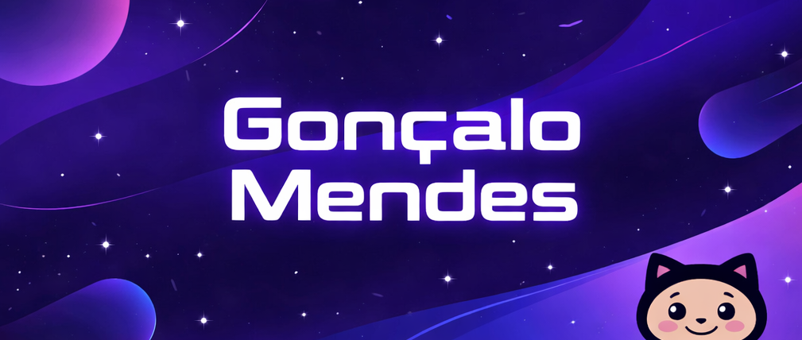

<!-- ===================== -->
<!-- PROFILE BANNER -->
<!-- ===================== -->

  

  <strong>Frontend Developer · React Enthusiast · Creative Technologist</strong>

  
  

---

## 👋 About Me

I’m a **frontend developer** passionate about building modern, interactive, and performant web applications.  
I specialize in crafting **clean, dynamic user interfaces** and seamless user experiences with **React** and modern frontend tooling.

- 💻 Frontend development with **React, Vue, JavaScript, TypeScript**
- 🎨 Focused on **UI/UX, accessibility, and performance**
- 🚀 Interested in **interactive experiences, creative coding, and modern web tooling**
- 🌍 Based in **Lisbon, Portugal**

---

## 🧰 Tech Stack

### Languages

  

### Frameworks & Tools

  

---

## 🚀 Featured Projects

### 🍽️ **foodi3**
A recipe management platform built with **React & TypeScript**.  
**Focus:** UI/UX, scalable frontend structure, clean data handling.

**Have a look**: https://foodi3.appwrite.network/auth

### 💻 **portfolio-2026**
My latest personal portfolio — a **React frontend** showcasing projects and professional growth.  
**Focus:** Component architecture, responsive design, performance optimization.

**Have a look**: https://gm-porfolio-2026.vercel.app/

### 🎨 **portfolio-sandra-lemos**
**Freelancing Project** a portfolio website built with **React** and **Typescript**.  
**Focus:** Component architecture, responsive design and figma fidelity, performance optimization.

**Have a look**: https://portfolio-sandra-lemos.vercel.app/

### 🎸 **Alexandre Morais Website**
A business website built with **React** and **Typescript**.  
**Focus:** Frontend design, static typing, performance optimization, interactive UI.

**Have a look** : https://alexandre-morais-bass.vercel.app/

### 🎹 **Bandspace**
MVP for a musicians’ network.  
**Focus:** React-driven frontend, event handling, and collaborative features.

### 🍹 **monarch-cocktail-bar**
Interactive marketing website for a Lisbon cocktail bar using **React & JavaScript**.  
**Focus:** Animations, interactive UI elements, responsive design.

**Have a look**: https://the-monarch-cocktail-bar.vercel.app/

---

## 📊 GitHub Stats

  
  

---

## 📈 Contribution Activity

<picture>
  <source media="(prefers-color-scheme: dark)" srcset="https://raw.githubusercontent.com/goncalofm90/goncalofm90/output/dist/github-contribution-grid-snake-dark.svg" />
  <source media="(prefers-color-scheme: light)" srcset="https://raw.githubusercontent.com/goncalofm90/goncalofm90/output/dist/github-contribution-grid-snake.svg" />
  
</picture>

---

## 🧠 Currently Exploring

- Advanced **React patterns** (hooks, context, state management)
- Component libraries & **design systems**
- **Performance optimization** & frontend architecture
- Tooling & **developer experience improvements**
- Interactive web experiences & creative coding

---

## 🤝 Let’s Connect

If you’re interested in collaborating, freelancing, or talking tech:

- 💼 LinkedIn: <a href="https://www.linkedin.com/in/goncalo-mendes" target="_blank" rel="noopener noreferrer">goncalo-mendes</a>  
- 🌐 Portfolio: <a href="https://gm-porfolio-2026.vercel.app" target="_blank" rel="noopener noreferrer">gm-porfolio-2026.vercel.app</a>  

